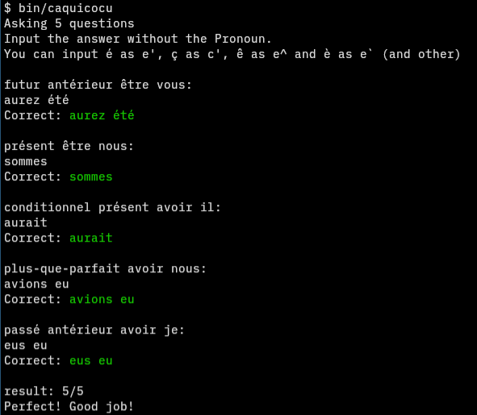

# Caquicocu

French conjugation practice CLI tool.

```
$ caquicocu --help
usage: caquicocu [n]
Give French conjugation exercises n times.
Input the answer without the Pronoun.
You can input é as e', ç as c', ê as e^ and è as e` (and other)
```

être, avoir, chanter en indicatif + conditionnel



---

[How to add verb (a bit for myself)](HOWTOADDVERB.md)
